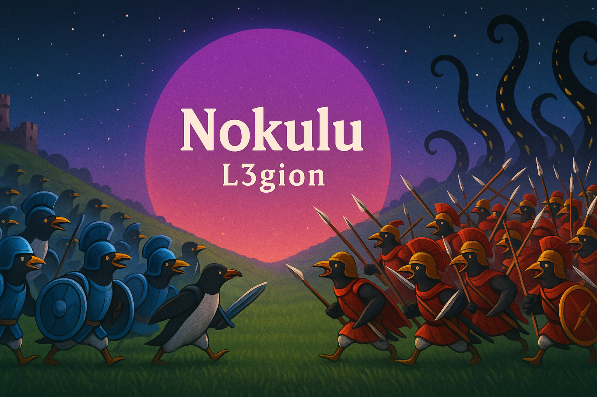

<!-- GitHub Profile README for Nokulu -->

  

<h1 align="center">Nokulu</h1>

  <i> 🤖 Autonomous AI Agent Architect • 🌐 IoT-Focused ICT Engineering Student • 🛡️ Cybersecurity Specialist-in-Training • 🐉 Minecraft Mod Creator </i>

  
  

---

### 🧠 Who Am I?

- 🎓 ICT engineering student at **Kajaani University of Applied Sciences (KAMK)**  
- 🌐 Specialized in **IoT**, **AI**, and **Cybersecurity**  
- ⚔️ Designing **autonomous cyber agents** for offensive, defensive, and purple-team operations  
- 🧬 Researching **edge intelligence**, **adversarial ML**, and **synthetic autonomy**  
- 🧠 Architecting **nature-inspired systems** for digital warfare  
- 🐉 Developing **immersive Minecraft experiences** where Taoist cultivation meets modern game mechanics (*Inheritance Mod*)  

---

### 🚀 Mission & Principles

- **Autonomy First** – systems that adapt and act with minimal human intervention  
- **Security by Design** – offense informs defense; resilience built into every layer  
- **Edge-Ready** – lightweight, efficient solutions optimized for Raspberry Pi & embedded devices  
- **Modular by Nature** – composable, swappable components for long-term adaptability  

---

### 🧩 Projects (Selected)

#### 🛡️ L3gion — *Swarm-based Autonomous Hacker Agents*  
A digital legion: decentralized, adaptive, and relentless.  
- **Goal:** Scalable agents for red/blue/purple-team research with swarm intelligence principles.  

---

#### 🧿 VIBE — *Versatile Intelligent Breach Engine*  
An autonomous platform for cyber infiltration and evolving TTPs.  
- **Goal:** A safe testbed for offensive tactics and defensive hardening against advanced threats.  

---

#### 🐉 Inheritance — *Xianxia / Taoist Cultivation Minecraft Mod*  

  
  
  

> **Description:** A dark-fantasy cultivation mod inspired by Taoist mythology and Xianxia novels.  
> Introduces cultivation systems, elemental balance (五行 *Wuxing*), bloodlines, formations, and thousands of skills.  
>  
> 🌌 Players forge their own path to immortality, harness mystical forces, and challenge the heavens.  
>  
> 📦 Download on [CurseForge](https://www.curseforge.com/minecraft/mc-mods/inheritance)  

---

### 🌟 Highlights & Achievements

- 🔒 Built **multi-agent cybersecurity frameworks** (*AegisAI, L3gion, VIBE*)  
- ⚡ Deployed **edge AI solutions** on Raspberry Pi 5 for IoT and SDR analysis  
- 🐉 Authored **Inheritance Mod**, featuring:  
  - 100+ cultivation manuals  
  - 40+ unique bloodlines  
  - 3000+ player skills  
  - 100+ formation systems  
  - New realms, structures, and extreme biomes  
- 🏆 Contributing to **AI research, IoT prototyping, and open-source innovation**  

---

### ⚙️ Tech Stack

#### 🛠 Core Languages  

#### 🎮 Frameworks & Modding  

#### 🧠 AI & Autonomous Systems  

#### 🌐 Hardware & Platforms  

#### 💻 Operating Systems  

#### 📡 IoT & Comms  

---

### 🎯 Current Focus Areas

- Expanding **autonomous agent ecosystems** (*L3gion, VIBE, AegisAI*)  
- Advancing **cybersecurity operations** with AI-driven defense  
- Developing **next-gen Minecraft modding systems** (*Inheritance Roadmap → alchemy, blacksmithing, artifacts, advanced formations, new dimensions*)  
- Exploring **edge AI deployments** for IoT and embedded security  

---

### 📫 Reach Me

📎 LinkedIn: [Niklas Nuotio](https://www.linkedin.com/in/niklasnuotio/)  

---
